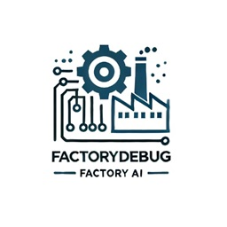

# Factory Debug (Coming Soon)

**Factory Debug** is a groundbreaking program designed to revolutionize debugging and code fixing using state-of-the-art AI technologies. By providing a program as input, Factory Debug AI identifies bugs, analyzes the code, and attempts to auto-fix issues autonomously. This innovative approach aims to save developers significant time and effort, enabling faster resolution of coding problems.

This project extends the power of AI into the debugging process, offering a smart, automated solution while still leaving room for human oversight and intervention when necessary.

---

## Features

- **AI-Powered Debugging**: Automatically detect and fix bugs in your code using cutting-edge AI models.
- **Autonomous Code Analysis**: Understands program logic to diagnose and resolve issues effectively.
- **Iterative Debugging Workflow**: Offers suggestions, applies fixes, and iteratively improves code quality.
- **Customizable Solutions**: Allows users to refine the AI-generated fixes for enhanced accuracy.
- **Developer-Friendly Interface**: Simple and intuitive interaction for seamless debugging experiences.

---

## Stay Tuned!

This revolutionary new tool is currently under development. Follow updates and announcements as we work towards bringing Factory Debug AI to life. 

For more information, visit [ruslanmv.com](https://ruslanmv.com).